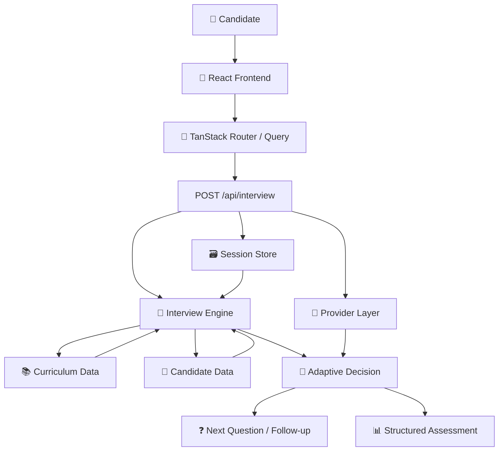
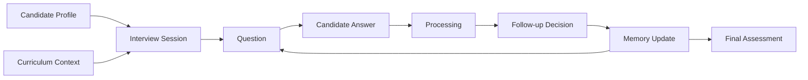

<div align="center">

# 🎙️ InterviewOS AI

### **Don't Build the Interview. Build the Interviewer.**

<p>
  <strong>An adaptive AI-powered technical interview platform that listens, remembers, adapts, probes, and evaluates.</strong>
</p>

<br/>

<a href="https://vico-dathon-pb-2.vercel.app/">

</a>
&nbsp;
<a href="https://github.com/dhanush080607/VicoDathon-pb-2">

</a>
&nbsp;
<a href="https://github.com/dhanush080607/VicoDathon-pb-2/blob/main/technical-spec.md">

</a>

<br/><br/>


<br/><br/>

> **Real interviews don't follow scripts. Real interviewers listen, adapt, and go deeper.**

</div>

---

# ⚡ What is InterviewOS AI?

**InterviewOS AI** transforms technical interview preparation into a conversational AI interviewer experience.

It isn't a static questionnaire.

It behaves like an interviewer that:

```text
                 ┌───────────────┐
                 │    LISTEN     │
                 └───────┬───────┘
                         ↓
                 ┌───────────────┐
                 │  UNDERSTAND   │
                 └───────┬───────┘
                         ↓
                 ┌───────────────┐
                 │    ANALYSE    │
                 └───────┬───────┘
                         ↓
                 ┌───────────────┐
                 │     ADAPT     │
                 └───────┬───────┘
                         ↓
                 ┌───────────────┐
                 │  GO DEEPER    │
                 └───────┬───────┘
                         ↓
                 ┌───────────────┐
                 │   EVALUATE    │
                 └───────┬───────┘
                         ↓
                 ┌───────────────┐
                 │    IMPROVE    │
                 └───────────────┘
```

Every candidate answer can influence what happens next.

Strong answers can trigger deeper probes.

Partial answers can trigger clarification.

Weak answers can return the conversation toward fundamentals.

And throughout the interview, context is maintained.

---

# 🚀 Live Experience

<div align="center">

## [🚀 Open InterviewOS AI](https://vico-dathon-pb-2.vercel.app/)

</div>

| Resource                   | Link                                                                                              |
| -------------------------- | ------------------------------------------------------------------------------------------------- |
| 🚀 Live Application        | [Open InterviewOS AI](https://vico-dathon-pb-2.vercel.app/)                                       |
| 💻 GitHub Repository       | [VicoDathon-pb-2](https://github.com/dhanush080607/VicoDathon-pb-2)                               |
| 📜 Technical Specification | [technical-spec.md](https://github.com/dhanush080607/VicoDathon-pb-2/blob/main/technical-spec.md) |
| 🤖 AI Usage Log            | [PROMPTS.md](https://github.com/dhanush080607/VicoDathon-pb-2/blob/main/PROMPTS.md)               |
| 📈 Commit History          | [View Commits](https://github.com/dhanush080607/VicoDathon-pb-2/commits/main/)                    |
| 👤 LinkedIn                | [H Dhanush](https://www.linkedin.com/in/h-dhanush-189565327/)                                     |

---

# 🧠 Why InterviewOS?

Traditional interview preparation is often built around memorizing questions.

InterviewOS focuses on **interviewer behaviour**.

| Traditional Preparation | InterviewOS AI                 |
| ----------------------- | ------------------------------ |
| Static question banks   | 🧠 Adaptive conversation       |
| Memorized answers       | 🎯 Reasoning-focused responses |
| Fixed question sequence | 🔄 Dynamic follow-ups          |
| No conversation memory  | 🗂️ Interview memory           |
| Generic feedback        | 📊 Structured assessment       |
| Fixed curriculum        | 📚 Candidate-aware curriculum  |
| Practice questions      | 🎙️ Interviewer experience     |

### The difference

```text
TRADITIONAL

Question
   ↓
Answer
   ↓
Next Question
   ↓
End
```

```text
INTERVIEWOS AI

Question
   ↓
Candidate Answer
   ↓
Understand
   ↓
Analyse
   ↓
Remember Context
   ↓
Decide
   ↓
Follow-up / New Topic
   ↓
Evaluate
   ↓
Improve
```

---

# ✨ Core Features

<table>
<tr>
<td width="50%">

### 🤖 Adaptive Interviewer

Questions are selected from curriculum context and can adapt based on previous responses.

</td>

<td width="50%">

### 🧠 Conversation Memory

The session remembers covered topics, strong signals, probing areas, and unassessed topics.

</td>
</tr>

<tr>
<td>

### 🔄 Adaptive Follow-ups

Follow-up and context-probe questions allow the interview to go deeper instead of blindly moving through a question list.

</td>

<td>

### 🎯 Curriculum Intelligence

Questions are grounded in the 31-day AI Cohort curriculum and candidate mission history.

</td>
</tr>

<tr>
<td>

### 📊 Interview Progress

Question progress and curriculum-day coverage remain visible throughout the interview.

</td>

<td>

### 📈 Structured Assessment

Completed interviews produce an overall score, dimensions, strengths, gaps, and a learning plan.

</td>
</tr>

<tr>
<td>

### ⚡ Dynamic Experience

Thinking, progress, memory, loading, and completion states update during the interview.

</td>

<td>

### 🎨 Premium Interface

Dark command-center visuals, glass surfaces, gradients, responsive layouts, and Framer Motion transitions.

</td>
</tr>
</table>

---

# 🎙️ The Interview Experience

## 01 — Candidate Selection

The candidate begins by selecting a learner profile.

The demo includes four sample candidates:

* Sarah Chen
* Marcus Lee
* Priya Nair
* Diego Alvarez

Each candidate has a distinct learning track and mission history.

---

## 02 — Interview Ready

The selected candidate enters an interview workspace containing:

```text
┌─────────────────────────────────────┐
│          INTERVIEW WORKSPACE        │
├─────────────────────────────────────┤
│                                     │
│  Progress       Curriculum Coverage │
│                                     │
│  ────────────────                   │
│                                     │
│          AI INTERVIEWER             │
│                                     │
│       Current Question              │
│                                     │
│  ───────────────────────────────    │
│                                     │
│          Answer Composer            │
│                                     │
│  Interview Memory                   │
│                                     │
└─────────────────────────────────────┘
```

---

## 03 — AI Interviewer

Each question is connected to curriculum context.

```text
Question
│
├── ID
├── Text
├── Curriculum Day
├── Day Title
├── Topic
├── Level
└── Kind
      ├── primary
      ├── followup
      └── context-probe
```

---

## 04 — Candidate Response

The candidate submits an answer through the answer composer.

Empty responses are rejected:

```text
400
empty_answer
```

---

## 05 — AI Thinking

During processing, the interface communicates that the interviewer is analysing the response.

```text
Candidate Answer
       ↓
   🧠 ANALYSING
       ↓
Response Understanding
       ↓
Follow-up Decision
       ↓
Next Question
```

---

## 06 — Adaptive Follow-up

The interviewer evaluates the answer and decides what happens next.

```text
                 Candidate Answer
                        │
              ┌─────────┼─────────┐
              ↓         ↓         ↓
           Probe     Clarify   Continue
              │         │         │
              └─────────┼─────────┘
                        ↓
                  Next Question
```

---

## 07 — Interview Completion

The interview becomes eligible for completion when:

```text
Questions Answered ≥ 8

          AND

Distinct Curriculum Days ≥ 4
```

---

## 08 — Structured Feedback

The final assessment contains:

* Summary
* Strengths
* Knowledge gaps
* Recommended next steps
* Overall score
* Assessment headline
* Scored dimensions
* Learning plan

---

# 🔄 Interview Lifecycle

```text
┌────────────┐
│   READY    │
└─────┬──────┘
      ↓
┌────────────┐
│   ASKING   │
└─────┬──────┘
      ↓
┌────────────┐
│ LISTENING  │
└─────┬──────┘
      ↓
┌────────────┐
│ ANALYSING  │
└─────┬──────┘
      ↓
┌────────────┐
│  ADAPTING  │
└─────┬──────┘
      ↓
┌────────────┐
│ FOLLOW-UP  │
└─────┬──────┘
      ↓
┌────────────┐
│ COMPLETED  │
└────────────┘
```

| State        | Meaning                        |
| ------------ | ------------------------------ |
| 🟣 READY     | Session prepared               |
| 🔵 ASKING    | Question presented             |
| 🟡 LISTENING | Waiting for candidate response |
| 🟠 ANALYSING | Processing response            |
| 🟢 ADAPTING  | Choosing what comes next       |
| ⚪ COMPLETED  | Evaluation ready               |

---

# 🧠 Interview Memory

InterviewOS maintains session-level memory so the interviewer can reason about the conversation instead of treating every answer as an isolated event.

```text
┌─────────────────────────────┐
│       INTERVIEW MEMORY      │
├─────────────────────────────┤
│                             │
│  ✓ Covered Topics           │
│                             │
│  ★ Strong Signals           │
│                             │
│  ⚠ Needs Probing            │
│                             │
│  ○ Not Assessed             │
│                             │
└─────────────────────────────┘
```

The session tracks:

* Questions asked
* Answers
* Curriculum days covered
* Topics
* Difficulty
* Answer quality
* Follow-ups
* Strengths
* Gaps
* Completion state

---

# 📚 Curriculum Intelligence

InterviewOS uses the **31-day AI Cohort curriculum** as the foundation for interview context.

Example topic progression:

```text
RAG
 ↓
Vector Databases
 ↓
Prompt Engineering
 ↓
Agentic AI
 ↓
MCP
 ↓
AI Deployment
 ↓
Production AI Systems
```

The candidate's learning journey is combined with curriculum context:

```text
31-Day Curriculum
        ↓
Candidate Mission History
        ↓
Completed / Attempted / Skipped
        ↓
Learning Signals
        ↓
Interview Context
        ↓
Question Selection
        ↓
Adaptive Follow-up
        ↓
Evaluation
```

---

# 📊 Interview Progress

Progress remains visible throughout the session.

```text
01 ✓
02 ✓
03 ✓
04 ●
05 ○
06 ○
07 ○
08+
```

| Symbol | Meaning   |
| ------ | --------- |
| ✓      | Completed |
| ●      | Current   |
| ○      | Upcoming  |

The API exposes:

```text
questionNumber
questionsAsked
minQuestions
daysCovered
minDays
```

### Completion Gate

```text
┌────────────────────────────┐
│ Minimum Questions     ≥ 8  │
│ Minimum Curriculum Days ≥4 │
└────────────────────────────┘
```

---

# 📈 Assessment Engine

Once the interview is complete:

```text
Interview
    ↓
Answer History
    ↓
Performance Analysis
    ↓
Overall Score
    ↓
Scored Dimensions
    ↓
Strengths + Gaps
    ↓
Learning Plan
```

### Assessment

```json
{
  "overallScore": 0,
  "headline": "...",
  "dimensions": [],
  "learningPlan": []
}
```

### Feedback

```json
{
  "summary": "...",
  "strengths": [],
  "gaps": [],
  "next": []
}
```

Scores and feedback are derived from the actual answer history.

---

# 🎨 Dynamic UI & Motion

InterviewOS is designed as a live interview command center.

### Implemented dynamic behaviours

* 🧠 Thinking / analysing indicator
* ✨ Framer Motion transitions
* 📊 Progress updates
* 📚 Curriculum coverage updates
* 🧠 Interview memory updates
* 🔄 State-driven UI
* 🎯 Completion transition
* 📱 Responsive layout
* 🪟 Glass / translucent surfaces
* 🌌 Gradient accents

### Motion philosophy

> **Animation communicates system state — not decoration.**

```text
QUESTION
   ↓
LISTENING
   ↓
ANALYSING
   ↓
DECIDING
   ↓
FOLLOW-UP
   ↓
CONTINUE
```

---

# 🏗️ Architecture



### Architecture Principle

The **deterministic interview engine controls the core behaviour**.

The provider layer can help phrase the turn, while the core demo does not depend on an external API key for its deterministic interview behaviour.

---

# 🔁 Data Flow



---

# 🧩 System Components

```text
InterviewOS AI
│
├── Candidate Experience
│   ├── Landing
│   ├── Candidate Selection
│   ├── Interview Workspace
│   └── Feedback
│
├── Interview Engine
│   ├── Question Selection
│   ├── Answer Analysis
│   ├── Follow-up Logic
│   ├── Context Probes
│   └── Completion Gates
│
├── Interview Memory
│   ├── Covered Topics
│   ├── Strong Signals
│   ├── Needs Probing
│   └── Not Assessed
│
├── Curriculum Intelligence
│   ├── Candidate Journey
│   ├── Curriculum Days
│   └── Topic Context
│
└── Assessment
    ├── Overall Score
    ├── Dimensions
    ├── Strengths
    ├── Gaps
    └── Learning Plan
```

---

# ⚙️ Tech Stack

| Technology          | Purpose                          |
| ------------------- | -------------------------------- |
| ⚛️ React 19         | UI runtime                       |
| 🔷 TypeScript       | Type-safe application code       |
| ⚡ Vite              | Development and production build |
| 🧭 TanStack Start   | Full-stack React framework       |
| 🛣️ TanStack Router | File-based routing               |
| 🔄 TanStack Query   | Client data / mutation layer     |
| 🎨 Tailwind CSS 4   | Styling system                   |
| 🧱 Radix UI         | Accessible primitives            |
| ✨ shadcn/ui         | UI component system              |
| 🎬 Framer Motion    | Motion and transitions           |
| 🛡️ Zod             | Request / schema validation      |
| 🖊️ Lucide React    | Icons                            |
| 🚀 Nitro            | Server runtime                   |

---

# 📁 Project Structure

<details>
<summary><strong>📂 Click to expand</strong></summary>

```text
VicoDathon-pb-2/
├── .lovable/
├── data/
│   ├── candidates.json
│   └── curriculum.json
├── public/
├── src/
│   ├── components/
│   │   ├── interview/
│   │   │   ├── AnswerComposer.tsx
│   │   │   ├── CandidateCard.tsx
│   │   │   ├── CurriculumCoverage.tsx
│   │   │   ├── FeedbackScore.tsx
│   │   │   ├── FeedbackSection.tsx
│   │   │   ├── InterviewHeader.tsx
│   │   │   ├── InterviewMemoryPanel.tsx
│   │   │   ├── InterviewMessage.tsx
│   │   │   ├── InterviewProgress.tsx
│   │   │   ├── LearningPlan.tsx
│   │   │   └── ThinkingIndicator.tsx
│   │   └── ui/
│   ├── data/
│   │   ├── candidates.json
│   │   └── curriculum.json
│   ├── hooks/
│   │   └── use-mobile.tsx
│   ├── lib/
│   │   ├── interview/
│   │   │   ├── client.ts
│   │   │   ├── data.ts
│   │   │   ├── engine.ts
│   │   │   ├── provider.server.ts
│   │   │   ├── questions.ts
│   │   │   └── session-store.server.ts
│   │   ├── error-capture.ts
│   │   ├── error-page.ts
│   │   ├── lovable-error-reporting.ts
│   │   └── utils.ts
│   ├── routes/
│   │   ├── api/
│   │   │   └── interview.ts
│   │   ├── __root.tsx
│   │   ├── candidates.tsx
│   │   ├── feedback.tsx
│   │   ├── index.tsx
│   │   ├── interview.tsx
│   │   └── README.md
│   ├── types/
│   ├── routeTree.gen.ts
│   ├── router.tsx
│   ├── server.ts
│   ├── start.ts
│   └── styles.css
├── AGENTS.md
├── PROMPTS.md
├── technical-spec.md
├── package.json
├── bun.lock
├── bunfig.toml
├── components.json
├── eslint.config.js
├── tsconfig.json
├── vite.config.ts
└── README.md
```

</details>

---

# 🔌 API Documentation

## `POST /api/interview`

```text
Content-Type: application/json
```

### Start Session

```json
{
  "sessionId": "unique-session-id",
  "candidate": {
    "id": "sarah-chen"
  }
}
```

### Subsequent Turn

```json
{
  "sessionId": "unique-session-id",
  "message": "candidate answer"
}
```

---

## 🟢 In-Progress Response

```text
HTTP 200
```

Contains:

```text
sessionId
reply
done: false

question
├── id
├── text
├── day
├── dayTitle
├── topic
├── level
└── kind

progress
├── questionNumber
├── questionsAsked
├── minQuestions
├── daysCovered
└── minDays

memory
├── covered
├── strongSignals
├── needsProbing
└── notAssessed

candidate
├── id
├── name
├── title
└── avatarInitials

engine
```

---

## 🏁 Completed Response

```text
HTTP 200
```

When the completion gates are satisfied:

```json
{
  "done": true,
  "feedback": {
    "summary": "...",
    "strengths": [],
    "gaps": [],
    "next": []
  },
  "assessment": {
    "overallScore": 0,
    "headline": "...",
    "dimensions": [],
    "learningPlan": []
  }
}
```

---

# 🛡️ Error Handling

|  HTTP | Error               |
| ----: | ------------------- |
| `400` | `invalid_json`      |
| `400` | `invalid_request`   |
| `400` | `empty_answer`      |
| `404` | `invalid_session`   |
| `404` | `missing_candidate` |
| `500` | `engine_error`      |

### Error Shape

```json
{
  "error": "code",
  "message": "human readable"
}
```

---

# 🧪 Testing

## Core Flow

```text
Landing (/)
      ↓
Candidate Selection (/candidates)
      ↓
Interview Workspace (/interview)
      ↓
Answer
      ↓
POST /api/interview
      ↓
Analysis
      ↓
Adaptive Follow-up
      ↓
Repeat
      ↓
≥ 8 Questions
      ↓
≥ 4 Curriculum Days
      ↓
Feedback / Assessment (/feedback)
```

### API Verification

1. Start with a candidate ID.
2. Create a stable `sessionId`.
3. Submit successive answers.
4. Confirm question progress.
5. Confirm `daysCovered`.
6. Confirm follow-up behaviour.
7. Confirm memory updates.
8. Confirm completed payload when gates are met.

---

# 💻 Run Locally

### 1. Clone

```bash
git clone https://github.com/dhanush080607/VicoDathon-pb-2.git
cd VicoDathon-pb-2
```

### 2. Install

Using Bun:

```bash
bun install
```

Or npm:

```bash
npm install
```

### 3. Development

```bash
bun run dev
```

Or:

```bash
npm run dev
```

### 4. Build

```bash
bun run build
```

### 5. Preview

```bash
bun run preview
```

Open the URL printed by the development server.

Typically:

```text
http://localhost:5173
```

> No external API keys are required for the core deterministic interview engine.

---

# 🏆 Hackathon Requirements

<div align="center">

| Requirement                                     | Status |
| ----------------------------------------------- | :----: |
| Conversational technical interview              |    ✅   |
| Minimum of 8 questions                          |    ✅   |
| Cover at least 4 different curriculum days      |    ✅   |
| Follow-up questions based on previous responses |    ✅   |
| Maintain conversation context                   |    ✅   |
| Produce structured feedback                     |    ✅   |
| Required `POST /api/interview` endpoint         |    ✅   |

</div>

---

# 🎯 Problem Statement

## VicoDathon — Problem Statement 2

### **The Interview Agent**

The challenge is not simply to build an interview.

It is to build the **interviewer**.

InterviewOS addresses this through:

```text
LISTEN
  +
UNDERSTAND
  +
REMEMBER
  +
ADAPT
  +
PROBE
  +
EVALUATE
```

---

# 🤖 AI Usage

AI-assisted development was documented throughout the project.

The development log covers:

* Planning
* Data foundation
* API implementation
* Adaptive engine
* Follow-up logic
* Context handling
* Provider abstraction
* Feedback system
* UI development
* Verification

### Full AI Development Log

[View PROMPTS.md →](https://github.com/dhanush080607/VicoDathon-pb-2/blob/main/PROMPTS.md)

> No secrets or API keys are stored in the repository.

---

# 📸 Screenshots

Add actual application screenshots here.

Recommended structure:

```text
docs/
└── screenshots/
    ├── landing.png
    ├── candidates.png
    ├── interview.png
    ├── memory.png
    └── feedback.png
```

### Landing Page

```html
<!-- Replace with actual screenshot -->


```

### Candidate Selection

```html
<!-- Replace with actual screenshot -->


```

### Interview Workspace

```html
<!-- Replace with actual screenshot -->


```

### Interview Memory

```html
<!-- Replace with actual screenshot -->


```

### Feedback & Assessment

```html
<!-- Replace with actual screenshot -->


```

---

# 🎬 Recommended Demo GIF

For maximum visual impact, add a short real screen recording here.

Recommended flow:

```text
Candidate Selection
        ↓
Interview Question
        ↓
Candidate Answer
        ↓
AI Thinking
        ↓
Adaptive Follow-up
        ↓
Progress Update
        ↓
Feedback
```

Recommended file:

```text
docs/demo.gif
```

Then add:

```html
<div align="center">


</div>
```

---

# ♿ Performance & Accessibility

InterviewOS includes:

* Responsive layouts
* Mobile-aware hooks
* Semantic controls
* Keyboard-reachable actions
* Focus-friendly interactions
* Type-safe request validation
* Efficient client transitions
* Clear loading states
* Clear thinking states

---

# 🗺️ Roadmap

## ✅ Completed

* Adaptive multi-turn interview engine
* Curriculum-aware question selection
* Candidate-aware question selection
* Session state
* Conversation context
* Follow-up questions
* Context probes
* Progress tracking
* Curriculum coverage
* Interview memory
* Structured feedback
* Learning plan
* `POST /api/interview`
* Premium dark interview UI
* Motion and transitions
* Responsive layout

## 🚧 Future

* Persistent session storage
* Additional candidate profiles
* Expanded curriculum
* Deeper answer-quality analytics
* Optional live voice interface
* Exportable interview reports

---

# 📜 Development History

The project was developed iteratively during the VicoDathon hackathon.

View the complete repository history:

### [📈 View Commit History →](https://github.com/dhanush080607/VicoDathon-pb-2/commits/main/)

---

# 🔗 Important Links

<div align="center">

|    | Resource                                                                                                |
| -- | ------------------------------------------------------------------------------------------------------- |
| 🚀 | [Live Demo](https://vico-dathon-pb-2.vercel.app/)                                                       |
| 💻 | [GitHub Repository](https://github.com/dhanush080607/VicoDathon-pb-2)                                   |
| 📜 | [Technical Specification](https://github.com/dhanush080607/VicoDathon-pb-2/blob/main/technical-spec.md) |
| 🤖 | [AI Usage Log](https://github.com/dhanush080607/VicoDathon-pb-2/blob/main/PROMPTS.md)                   |
| 📈 | [Commit History](https://github.com/dhanush080607/VicoDathon-pb-2/commits/main/)                        |
| 👤 | [LinkedIn](https://www.linkedin.com/in/h-dhanush-189565327/)                                            |

</div>

---

# 👨‍💻 Built By

<div align="center">

## H Dhanush

### CSE — Data Science

**Frontend Developer • UI Designer • AI/ML Enthusiast**

<br/>

<a href="https://www.linkedin.com/in/h-dhanush-189565327/">

</a>

</div>

---

<div align="center">

# 🎙️ InterviewOS AI

### **Don't Build the Interview. Build the Interviewer.**

<br/>

```text
LISTEN
   ↓
UNDERSTAND
   ↓
ADAPT
   ↓
PROBE
   ↓
EVALUATE
   ↓
IMPROVE
```

<br/>

### 🚀 Built for VicoDathon Hackathon

**Problem Statement 2 — The Interview Agent**

<br/>

> **Real interviews don't follow scripts.**

<br/>

⭐ If you find the project interesting, consider giving the repository a star.

</div>
